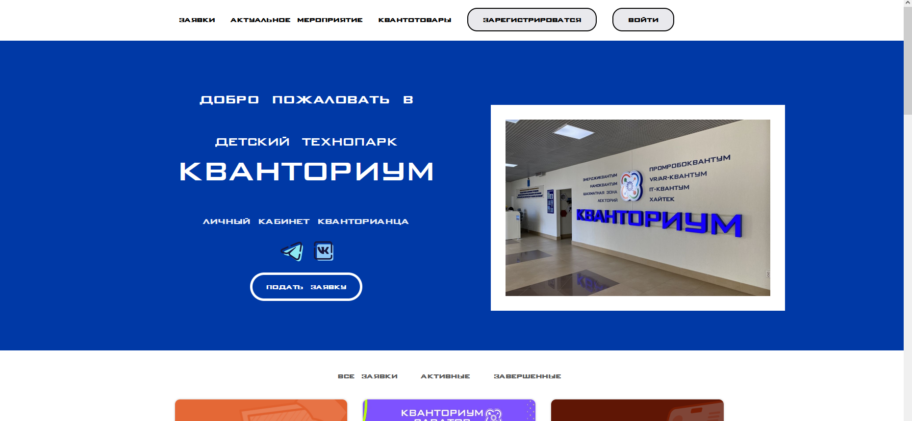
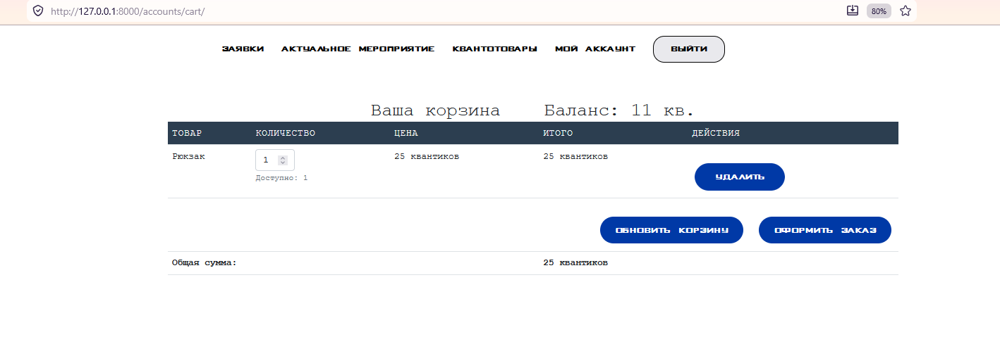
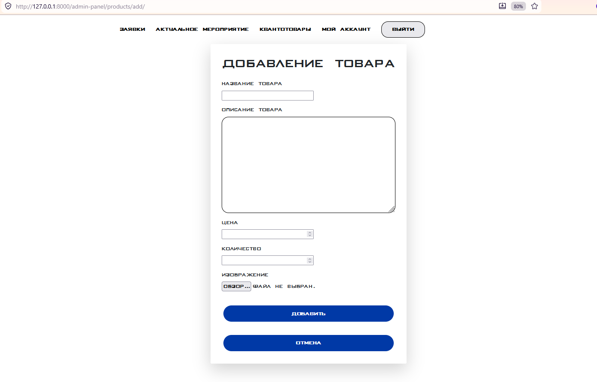

# 🎒 Школьный магазин мерча

Django-приложение для покупки школьной атрибутики за виртуальную валюту.  
**🏆 Победитель хакатона [Название хакатона] (1 место)**

---

## 📸 Скриншоты

| Главная страница | Корзина | Админ-панель |
|-----------------|---------|---------------|
|  |  |  |


## 🚀 Функционал

- Система виртуальной валюты (ученики получают монеты за успехи)
- Каталог мерча с карточками товаров
- Добавление в корзину и оформление заказа
- Админ-панель для загрузки новых товаров и просмотра заказов
- Личный кабинет с балансом и историей покупок

---

## 🛠 Технологии

- Python 3.9+
- Django 4.2
- SQLite (для разработки)
- HTML + CSS (Bootstrap 5)
- Git

---

## 🔧 Установка и запуск (для тех, кто хочет проверить)

```bash
# Клонировать репозиторий
git clone https://github.com/IronLay/Kvantomarket.git
cd quantic_shop

# Создать виртуальное окружение
python -m venv venv
source venv/bin/activate  # или venv\Scripts\activate на Windows

# Установить зависимости
pip install -r requirements.txt

# Применить миграции
python manage.py migrate

# Создать суперпользователя (для входа в админку)
python manage.py createsuperuser

# Запустить сервер
python manage.py runserver
